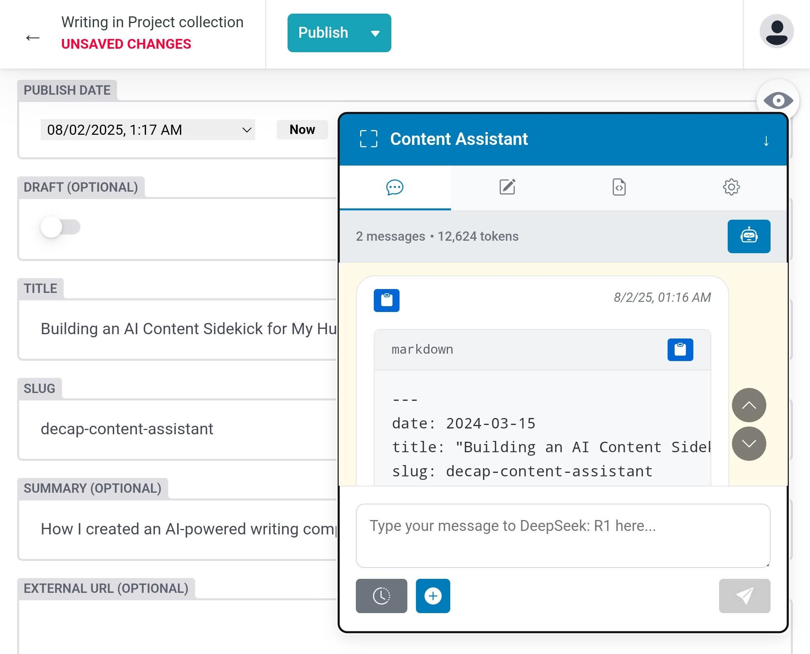
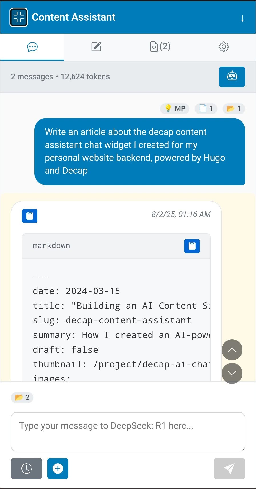
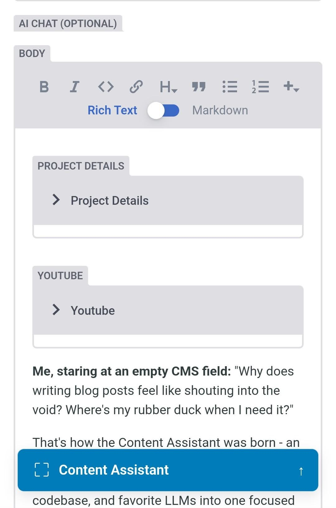
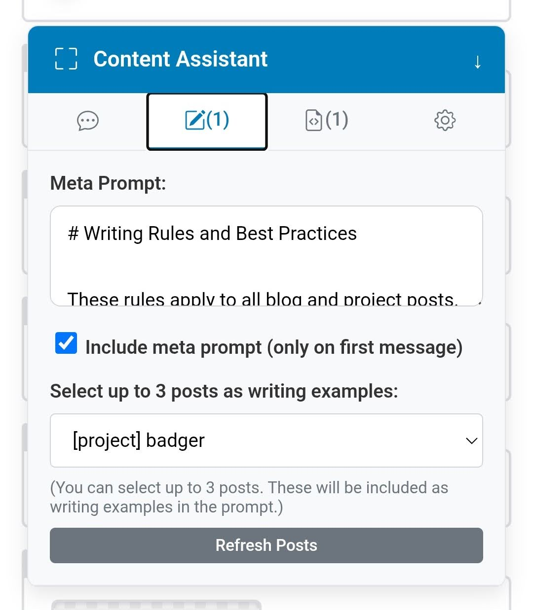
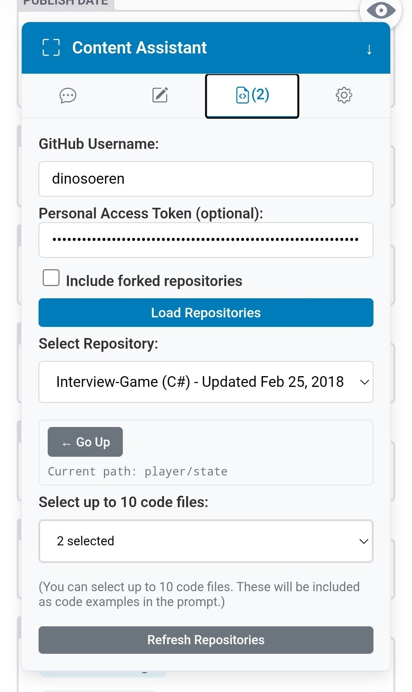
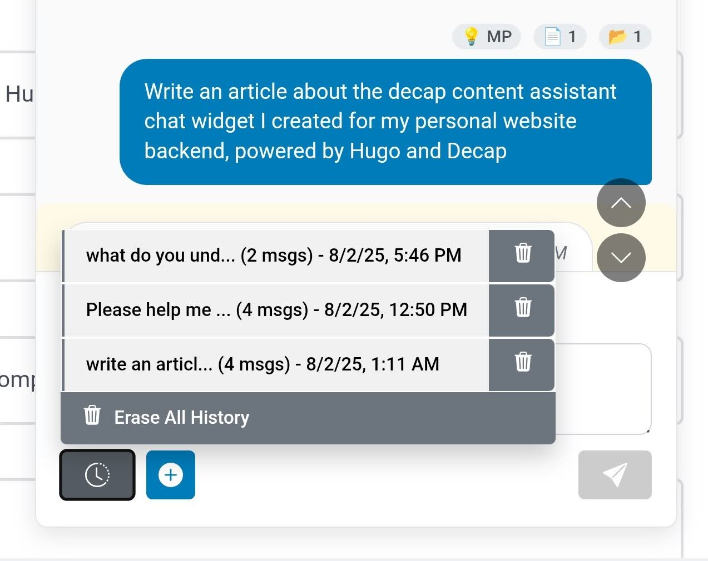
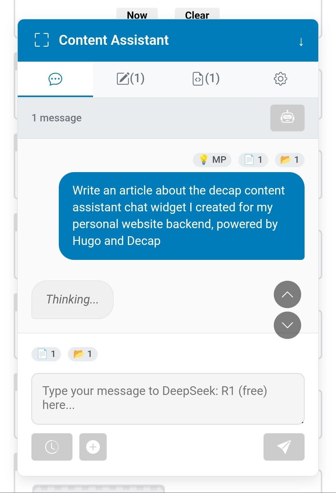
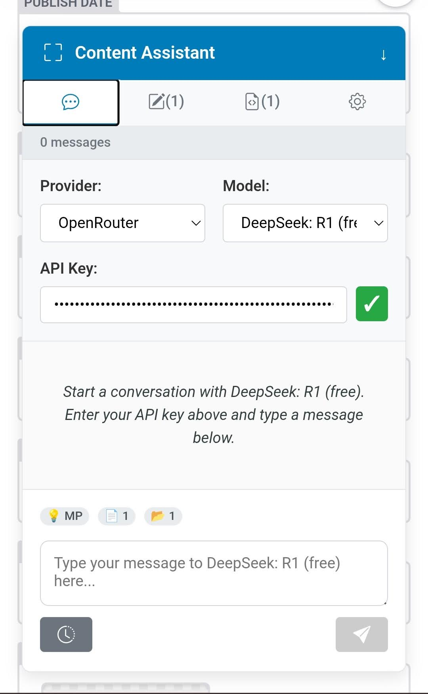

# Content Assistant - Responsive AI Chat Widget for Decap CMS

A custom widget for [Decap CMS](https://decapcms.org/) that provides an AI chat interface with content-aware prompting, chat history, and deep integration with your site's content and code repositories.

Features [secure integration](#ai-integration--chat) with chat APIs from Anthropic, Google, and OpenAI, as well as the hundreds of providers and models available on OpenRouter.



## Quick Setup Guide

1. Add the submodule in your `admin/widgets` directory:

```bash
git submodule add https://github.com/dinosoeren/decap-ai-chat-widget.git static/admin/widgets/ai-chat/
```

2. Add the script, style, and dependencies to your `admin/index.html`:

```html
<!-- Content Assistant - AI Chat Widget -->
<script type="module" src="widgets/ai-chat/index.js"></script>
<link rel="stylesheet" href="widgets/ai-chat/css/main.css" />
<!-- Crypto functions to encrypt/decrypt API keys. -->
<script src="https://cdnjs.cloudflare.com/ajax/libs/crypto-js/4.2.0/crypto-js.min.js" integrity="sha512-a+SUDuwNzXDvz4XrIcXHuCf089/iJAoN4lmrXJg18XnduKK6YlDHNRalv4yd1N40OKI80tFidF+rqTFKGPoWFQ==" crossorigin="anonymous" referrerpolicy="no-referrer"></script>
<!-- Purify unsafe HTML before rendering arbitrary markdown -->
<script src="https://cdnjs.cloudflare.com/ajax/libs/dompurify/3.2.6/purify.min.js" integrity="sha512-YlctBG9PGZIhh9keoqI3eZkQM9T8QUbiBi7qNYAO/TUEo8jqWX5pLp5+x1cKRQDRzJ/lyGyJ9WUVNIRduxIIFw==" crossorigin="anonymous" referrerpolicy="no-referrer"></script>
<!-- Render markdown in AI chat responses -->
<script src="https://cdnjs.cloudflare.com/ajax/libs/marked/16.1.1/lib/marked.umd.min.js" integrity="sha512-Y+X2CTquZ2g4C2RCgqXQgLJV4I9r2v1CNfOyMj9AXvoQic71ClH4BYjBQl3zZYJu+VRfn+BGz7+GQ3Tu5/f7/A==" crossorigin="anonymous" referrerpolicy="no-referrer"></script>
```

3. Add the widget as a field to the `collections` you want to use it for in Decap config:

```yaml
# admin/config.yml
collections:
  - name: 'blog'
    fields:
      - { label: 'Title', name: 'title', widget: 'string' }
      # ... other fields ...
      - { label: 'AI Chat', name: 'ai_chat', widget: 'ai-chat', required: false }
      - { label: 'Body', name: 'body', widget: 'markdown' }
```

## Features

The widget is organized into four main tabs: **Chat**, **Posts**, **Files**, and **Settings**.

### UI & Navigation

- **Responsive Design**: Fully responsive for chatting on mobile and desktop.
- **Tabbed Interface**: Easily switch between the chat, post selection, and file selection views.
- **Fullscreen & Collapsible**: Expand the widget for a focused chat experience or collapse it to save space.
- **Keyboard Navigation**: Use the up/down arrow keys to quickly navigate between messages in the chat view.
- **Message Actions**: Copy AI responses and code blocks to your clipboard with a single click.

<div class="grid" markdown>




</div>

### Meta Prompting & Content Examples

- **Meta Prompt**: Define a persistent writing style guide or instruction set that gets automatically injected into the first message of a new conversation.
- **Post Selection**: Browse and select up to 3 posts from your site to use as writing examples.
- **Dynamic Loading**: Automatically loads post content from the GitHub API with a sitemap fallback.
- **Cache Refresh**: Use the "Refresh Posts" button to clear the local cache and fetch the latest post list.



### Code-Aware Context

- **GitHub Integration**: Browse any public GitHub user's repositories, and your own private repos.
- **Repository Navigation**: Navigate through the full directory structure of a selected repository.
- **Fork Visibility**: Choose to include or exclude forked repositories in your search.
- **File Selection**: Select up to 10 code files to include as context in your prompt.
- **File Metadata**: The browser displays file sizes to help you make informed selections.
- **Cache Refresh**: Use the "Refresh Repositories" button to clear cached repository and file data.



### AI Integration & Chat

- **Secure Integration**: Your API keys never leave your device and stay encrypted in browser storage.
- **Multi-Provider Support**: Switch between built-in LLM providers (Anthropic, Google, OpenAI).
  - **OpenRouter Support**: Use any LLM provider and model compatible with the [OpenRouter API](https://openrouter.ai/models).
  - **Fine-tune Parameters**: Adjust the temperature, max tokens, and system prompt in widget settings.
  - **Switch Models**: Continue a conversation with a new model at any time.
- **Context-Aware Prompts**: Automatically injects selected posts, code files, and the meta prompt into your conversation.
- **Attachment Indicators**: Icons (💡, 📄, 📂) appear on your messages to confirm which context was included.
- **Token Tracking**: Keep an eye on your token usage with a live counter.
- **Chat History**: Conversations are automatically saved and can be restored.
  - **History Dropdown**: Restore previous conversations from any post.
  - **New Chat**: Start a fresh conversation at any time.
  - **Clear History**: Erase the chat history for a single chat or for all chats.



## Usage

1.  **Configure Context (Optional)**:
    - Go to the **Posts** tab to select writing examples and set your meta prompt.
    - Go to the **Files** tab to select code samples from GitHub repositories.
2.  **Start Chatting**:
    - In the **Chat** tab, select your desired AI model.
    - Enter your API key (it gets cached for future use).
    - Start your conversation!



## API Keys

API keys never leave your device. They are encrypted before being cached locally in your browser.

- **Anthropic**: Get your API key from [Anthropic Console](https://console.anthropic.com/settings/keys)
- **Gemini**: Get your API key from [Google AI Studio](https://makersuite.google.com/app/apikey)
- **OpenAI**: Get your API key from [OpenAI Platform](https://platform.openai.com/api-keys)
- **OpenRouter**: Get your API key from [OpenRouter Settings](https://openrouter.ai/settings/keys)



> **Note**: Never commit API keys to version control.

## Caching

The widget implements intelligent caching to improve performance and reduce API calls.

- **Post & Repository Cache**: Post lists, post content, repository lists, and file contents are cached for **24 hours**.
- **Chat Cache**:
  - The active conversation is saved automatically as you chat.
  - Past conversations are stored in the **History** dropdown, scoped to the post you are currently editing.
- **Settings Cache**: Your selected model, meta prompt, and code selection settings are cached indefinitely.
- **Cache Clearing**: Use the "Refresh Posts" and "Refresh Repositories" buttons to manually clear the relevant cache and fetch fresh data. The "Erase Chat" and "Erase All History" buttons manage the chat conversation cache.

## GitHub API Limits

The widget uses the GitHub API to fetch repositories and file content. Unauthenticated requests are limited to 60 requests per hour.

API responses are cached locally in your browser for 24-hours to help mitigate these limits. For higher limits (up to 5000 requests per hour) and access to your private repositories, use a GitHub personal access token.

## Troubleshooting

- **Rate limit errors**: Wait an hour or use cached data.
- **User not found**: Check the GitHub username spelling.
- **Repository not found**: Ensure the repository exists and is public.
- **File loading errors**: Check if the file is accessible via GitHub's raw URLs. Very large files may cause performance issues.
